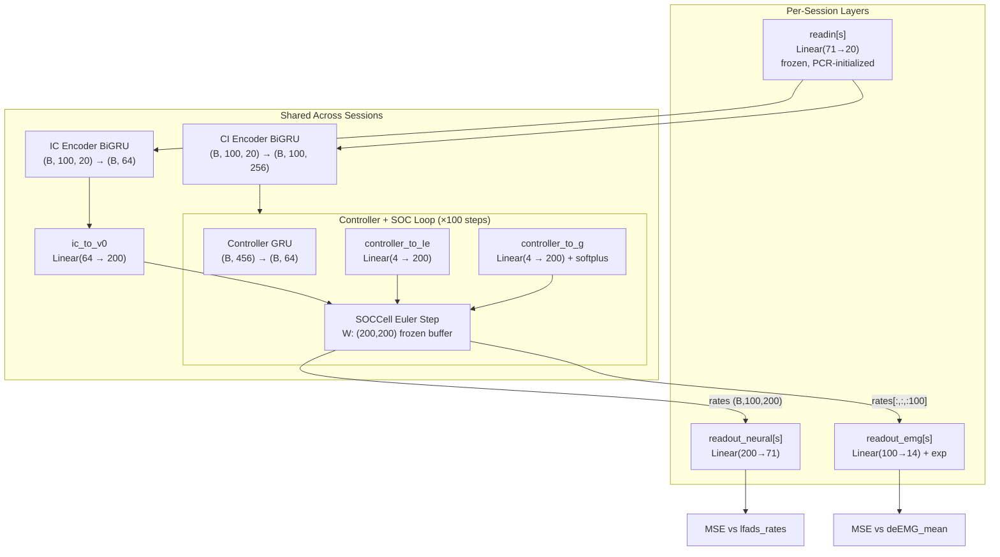

# LFADS-SOC MVP: Implementation Plan (Post-Implementation)

> **Status:** Components 1–8 implemented and verified. Remaining: Hydra config, training, evaluation.

## Conceptual Narrative

A single trial of neural+muscle data flows through the model:

1. **Readin:** The `lfads_rates` data for session `s` (e.g. 71 dims for session 013 — same as the raw neuron count) gets mapped through a per-session PCR-initialized linear layer into a shared 20-dimensional space. This is how lfads-torch handles different neuron counts across sessions — every session's data enters the model in the same dimensionality.

2. **Encoding:** The 20-dim encoded data flows through two BiGRU encoders. The **IC encoder** compresses the full sequence into a single vector that captures "where was the neural state at the start?" The **CI encoder** produces a time-varying signal at every timestep that tells the controller "what's happening right now?"

3. **Decoding (SOC replaces GRU):** Here's where things change. Standard LFADS would feed the IC and controller signals into a GRU generator. Instead, we:
   - Map the IC latent vector to an **initial voltage** `v₀` for a population of `N` neurons (e.g. 200)
   - At each timestep, the controller GRU produces an output vector which gets projected through two separate linear layers into:
     - **Tonic input** `I_e` (N-dim): a drive signal to each SOC neuron
     - **Gain** `g` (N-dim, always positive via softplus): modulates each neuron's response
   - The SOC cell takes `(v, I_e, g)` and produces the next voltage and firing rates via a simple Euler step through a fixed E/I weight matrix

4. **Readout (Dual-headed):** The rate vector from the SOC gets split:
   - **All N units** → linear → neural reconstruction (per-session readout maps N → session's neuron count)
   - **First N/2 units (excitatory only)** → linear → exp → EMG reconstruction (per-session readout maps N/2 → 14 EMG channels)

5. **Loss:** Simple MSE between predictions and continuous targets, summed across both heads. Continuous targets (`lfads_rates`, `deEMG_mean`) are ideal for MSE — they are smooth outputs from already-trained LFADS models.

---

## Data Pipeline

### Source Data

NWBDataset pickles at `/snel/share/share/tmp/scratch/cbwash2/auyong_nwb/binsize_10ms_pcr_high_reg_ALL_cw/`

Each pickle contains a `snel_toolkit.datasets.nwb.NWBDataset` with fields:
- `lfads_rates`: smooth firing rates from trained spike-LFADS (dim = raw neuron count)
- `deEMG_mean`: smooth decoded EMG from trained EMG-LFADS (14 channels)

### PCR Alignment (readin matrices)

**Following [auyong_pcr_alignment_v4.py](file:///home/cbwash2/emg-dynamics/emg_paper/nwb_conversion/auyong_pcr_alignment_v4.py) exactly:**

1. Load each session's pickled NWBDataset
2. Exclude first 4 and last 2 trials (standard practice)
3. Align trials to `start_time` via `DataWrangler` with range `(-100, 600)` ms → 71 timebins
4. Cycle-average across all trials per session → `cycle_avg` shape `(71, n_channels)`
5. Concatenate all sessions horizontally → `global_avg` shape `(71, Σ n_channels_across_sessions)`
6. PCA on mean-centered global averages (excluding NaN rows) → `global_pcs` (n_valid_times, n_pcs)
7. Ridge regression per session (α=0.01): `(session_avg - session_mean) → global_pcs`
   - `W = lr.coef_.T` → shape `(n_channels, n_pcs)` → **readin_weight**
   - `readout_bias = session_mean` → shape `(n_channels,)` — channel means

> [!IMPORTANT]
> PCR alignment is computed on **cycle-averaged, trial-aligned** data, NOT on raw continuous data. The chopped continuous data is used for training; the PCR matrices are used to initialize the per-session readin/readout layers.

| Parameter | Neural | EMG |
|---|---|---|
| PCR dim | 20 | 10 |
| L2 scale (Ridge α) | 0.01 | 0.01 |
| PCA explained var | 0.9999 | 0.9934 |

### Chopping (training data)

Continuous `lfads_rates` and `deEMG_mean` are chopped identically:
- **Window**: 100 bins (1 second at 10ms bin size)
- **Overlap**: 20 bins (200ms)
- **Stride**: 80 bins
- **Train/valid split**: every 5th chop → validation (4:1 ratio)

### Actual Data Dimensions

| Session | Neural Dim (`lfads_rates`) | EMG Dim (`deEMG_mean`) | Timesteps | Readin Shape | Train | Valid |
|---|---|---|---|---|---|---|
| 013 | 71 | 14 | 7533 | (71, 20) | 74 | 19 |
| 023 | 62 | 14 | 8162 | (62, 20) | 80 | 21 |
| 028 | 65 | 14 | 8330 | (65, 20) | 82 | 21 |
| 030 | 63 | 14 | 7743 | (63, 20) | 76 | 20 |
| 031 | 62 | 14 | 7793 | (62, 20) | 77 | 20 |
| 033 | 59 | 14 | 6736 | (59, 20) | 66 | 17 |

### Output H5 Files

```
datasets/soc_gran/
├── neural/lfads_torch_readin{sid}_neural.h5
│   ├── train_encod_data   (n_train, 100, n_neurons) float32
│   ├── train_recon_data   (n_train, 100, n_neurons) float32  [= encod_data]
│   ├── valid_encod_data   (n_valid, 100, n_neurons) float32
│   ├── valid_recon_data   (n_valid, 100, n_neurons) float32
│   ├── readin_weight      (n_neurons, 20) float64
│   └── readout_bias       (n_neurons,) float64
└── emg/lfads_torch_readin{sid}_emg.h5
    ├── train_encod_data   (n_train, 100, 14) float32
    ├── train_recon_data   (n_train, 100, 14) float32
    ├── valid_encod_data   (n_valid, 100, 14) float32
    ├── valid_recon_data   (n_valid, 100, 14) float32
    ├── readin_weight      (14, 10) float64
    └── readout_bias       (14,) float64
```

---

## Architecture Dimensions

```
Configurable hyperparameters:
  encod_data_dim = 20       # shared neural dim after readin (from readin_weight cols)
  encod_seq_len  = 100      # T
  recon_seq_len  = 100      # T (same as encod for MVP)
  ic_enc_dim     = 128      # BiGRU hidden (per direction)
  ci_enc_dim     = 128      # BiGRU hidden (per direction)
  ic_dim         = 64       # IC latent dimension
  con_dim        = 64       # Controller GRU hidden state
  co_dim         = 4        # Controller output dimension
  
SOC-specific:
  soc_N          = 200      # SOC population (must be even)
  soc_dt         = 0.5      # Euler step size (ms)
  soc_tau        = 10.0     # Membrane time constant (ms)
  
Data-specific:
  emg_dim        = 14       # EMG channels (constant across sessions)
  neural_dim_s   = varies   # raw neural dim per session (for readout)
```

---

## Multisession Handling

### How standard lfads-torch does it
```
Per-session:  readin[s]:  Linear(raw_neural_dim_s → encod_data_dim)   # pre-computed PCR, frozen
Per-session:  readout[s]: Linear(fac_dim → raw_neural_dim_s)          # learned

Shared:       encoder, decoder (GRU generator), priors
```

### How LFADS-SOC does it
```
Per-session:  readin[s]:         Linear(raw_neural_dim_s → encod_data_dim)   # reused same format, frozen
Per-session:  readout_neural[s]: Linear(N → raw_neural_dim_s)                # maps SOC rates to neural space
Per-session:  readout_emg[s]:    Linear(N//2 → emg_dim)                      # maps excitatory rates to EMG

Shared:       encoder, SOC decoder (SOCCell + controller), priors
```

> [!NOTE]
> Since EMG dim is constant (14) across sessions, `readout_emg` *could* be a single shared layer. But for consistency with the lfads-torch pattern (and to allow future session-specific EMG differences), it's per-session.

---

## Full Tensor Flow (One Forward Pass)

```
Step 1: READIN (per-session)
  Input:  encod_data[s]                  (B, 100, raw_neural_dim_s)
  Output: readin[s](encod_data[s])       (B, 100, 20)
  → concatenate across sessions          (B_total, 100, 20)

Step 2: IC ENCODER
  Input:  (B_total, 100, 20)
  → ic_enc BiGRU → concat fwd+bwd       (B_total, 256)
  → ic_linear → split mean/logvar       (B_total, 64) each
  → rsample                              (B_total, 64)

Step 3: CI ENCODER
  Input:  (B_total, 100, 20)
  → ci_enc BiGRU                         (B_total, 100, 256)

Step 4: SOC DECODER — init
  v_0 = ic_to_v0(ic_samp)                (B_total, 200)
  con_state = con_h0                      (B_total, 64)
  r_feedback = zeros                      (B_total, 200)

Step 5: SOC DECODER — temporal loop (t = 0..99)
  For each timestep t:
    ci_t = ci[:, t, :]                    (B_total, 256)
    
    Controller GRU:
      con_input = [ci_t, r_feedback]      (B_total, 256 + 200 = 456)
      con_state = con_cell(con_input, con_state)   (B_total, 64)
      co_params = co_linear(con_state)    (B_total, 8)
      con_output = rsample                (B_total, 4)
    
    SOC projections:
      I_e = controller_to_Ie(con_output)  (B_total, 4) → (B_total, 200)
      g   = softplus(controller_to_g(...))            → (B_total, 200)
    
    SOC Euler step:
      r   = relu(g ⊙ v)                  (B_total, 200)
      Wr  = W @ r                         (200, 200) @ (200, B) → (B_total, 200)
      dv  = Wr + I_e
      v   = (1 - dt/τ)·v + (dt/τ)·dv     (B_total, 200)
      
      store r → rates list
      r_feedback = r
  
  Stack: rates                            (B_total, 100, 200)

Step 6: DUAL READOUT (per-session)
  Split rates back by session:            rates[s] = (B_s, 100, 200)
  
  Neural head:
    readout_neural[s](rates[s])           (B_s, 100, raw_neural_dim_s)
  
  EMG head:
    r_exc = rates[s][:, :, :100]          (B_s, 100, 100)
    readout_emg[s](r_exc) → exp()        (B_s, 100, 14)

Step 7: LOSS
  loss_neural = MSE(neural_pred, neural_target)
  loss_emg    = MSE(emg_pred, emg_target)
  total = mean(loss_neural + loss_emg) + KL(ic) + KL(co) + L2(encoder)
```

---

## Implemented Files

| File | Status | Purpose |
|---|---|---|
| [recurrent.py](file:///home/cbwash2/bsg-lfads/lfads_torch/modules/recurrent.py) | ✅ Modified | Appended `SOCCell` class |
| [soc_decoder.py](file:///home/cbwash2/bsg-lfads/lfads_torch/modules/soc_decoder.py) | ✅ New | Controller GRU + SOCCell loop |
| [readout.py](file:///home/cbwash2/bsg-lfads/lfads_torch/modules/readout.py) | ✅ New | DualReadout + MultisessionDualReadout |
| [soc_model.py](file:///home/cbwash2/bsg-lfads/lfads_torch/soc_model.py) | ✅ New | LFADS_SOC LightningModule |
| [soc_datamodules.py](file:///home/cbwash2/bsg-lfads/lfads_torch/soc_datamodules.py) | ✅ New | Paired neural+EMG H5 loading |
| [prepare_soc_data.py](file:///home/cbwash2/bsg-lfads/scripts/prepare_soc_data.py) | ✅ New | PCR alignment + chopping → H5 |
| [save_soc_weights.py](file:///home/cbwash2/bsg-lfads/scripts/save_soc_weights.py) | ✅ New | Generate SOC W matrix |
| [test_soc_smoke.py](file:///home/cbwash2/bsg-lfads/scripts/test_soc_smoke.py) | ✅ New | Smoke tests |

### Unchanged (reused from lfads-torch)
- `lfads_torch/modules/encoder.py` — IC + CI BiGRU encoders
- `lfads_torch/modules/priors.py` — KL divergence priors
- `lfads_torch/modules/recons.py` — MSE reconstruction class
- `lfads_torch/modules/readin_readout.py` — MultisessionReadin/Readout (PCR-initialized)
- `lfads_torch/datamodules.py` — original BasicDataModule

---

## Key Design Decisions

### Why `lfads_rates` and `deEMG_mean` as targets?
These are the smooth outputs of already-trained LFADS models. If the SOC cannot reproduce what a GRU-LFADS extracted, there's no point trying raw spikes. MSE loss is natural for smooth continuous values.

### Why freeze W?
The SOC weight matrix encodes a specific E/I circuit structure (stability-optimized). Letting it train would destroy the biophysical motivation. The controller learns to drive the circuit, and the readout learns to decode from it.

### Why dual readout with excitatory-only EMG?
Muscle activity must be non-negative (it's a rectified signal). In the SOC, excitatory neurons produce positive rates by construction, so the EMG readout only sees the first N/2 (excitatory) units. The `exp()` activation enforces strict positivity.

### Why PCR for readin?
PCR (Principal Component Regression) is the standard method used in the original lfads-torch pipeline for this dataset ([auyong_pcr_alignment_v4.py](file:///home/cbwash2/emg-dynamics/emg_paper/nwb_conversion/auyong_pcr_alignment_v4.py)). It maps variable-dimensional sessions into a shared latent space using trial-averaged neural dynamics. We replicate the exact same procedure on `lfads_rates` and `deEMG_mean`.

### Why is the gain branch (`g`) unused?
The `controller_to_g` projection exists and produces positive values via softplus, but the current SOCCell simply multiplies `g * v` before the ReLU. With g initialized near 1, this is essentially identity. A future integration with the `auto-nn` encoder's gain branch would allow direct gain encoding from data. TODO tags are in place.

---

## Architecture Diagram



---

## Verification Results

All tests pass with `conda run -n lfads-torch-cuda12`:

```
=== Test: SOCCell ===
  ✓ Buffer, E/I, shapes, stability all correct
=== Test: DualReadout ===
  ✓ Shapes and positivity correct
=== Test: Gradient Flow ===
  ✓ Gradients flow correctly (W frozen, projections trainable)

=== Full LFADS_SOC end-to-end test ===
  Forward pass: neural_pred (4, 10, 15), emg_pred (4, 10, 5), rates (4, 10, 20)
  Training loss: 2.054852
  Parameters with gradients: 35/35
  W is correctly frozen (no gradients)
  ✓ PASSED
```

---

## Remaining Steps

### 1. Hydra Config
Create a YAML config targeting `lfads_torch.soc_model.LFADS_SOC`, similar to `configs/model/rouse_multisession_PCR.yaml`.

### 2. End-to-End Real Data Test
Verify forward + backward pass with the actual `datasets/soc_gran/` H5 files (not synthetic data).

### 3. Full Training Run
```bash
conda run -n lfads-torch-cuda12 python -m lfads_torch.run_model \
  --config-name=soc_gran
```

### 4. Evaluation
- R² for neural head (per session)
- R² for EMG head (per session)
- Inspect SOC rate dynamics qualitatively

### 5. Future Work
- Integrate `auto-nn` gain branch for direct gain encoding
- Explore warm-starting encoder from trained LFADS weights
- Experiment with different SOC N sizes (100, 400, 800)

---

## Reference Scripts

| Script | Purpose | Env |
|---|---|---|
| [auyong_pcr_alignment_v4.py](file:///home/cbwash2/emg-dynamics/emg_paper/nwb_conversion/auyong_pcr_alignment_v4.py) | Original PCR alignment for spike-LFADS | `stkit-nwb` |
| [auyong_post_path_length_notebook_v3.py](file:///home/cbwash2/emg-dynamics/emg_paper/nwb_conversion/auyong_post_path_length_notebook_v3.py) | Post-LFADS analysis: EMG burst detection, separate PCR, visualization | `stkit-nwb` |
| [1_data_prep.ipynb](file:///home/cbwash2/bsg-lfads/tutorials/multisession/1_data_prep.ipynb) | lfads-torch multisession tutorial | `lfads-torch-cuda12` |

> [!NOTE]
> The `auto-nn/` submodule's gain branch (`g_enc`) is preserved but unused. A `TODO` for integrating it into the SOC model for direct gain encoding from data is noted in the code.
